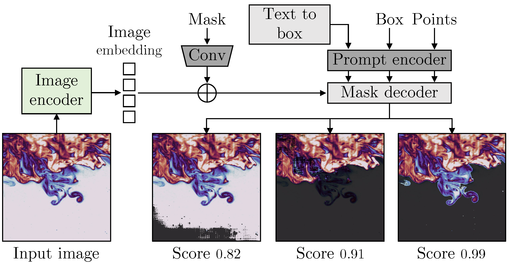
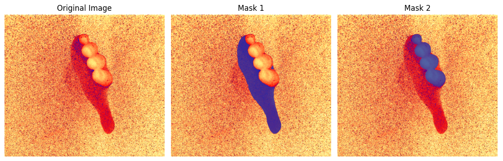

# Flow_segmentation

Este es el repositorio oficial de "Segment Anything in Flow Experiments".

## Noticias

- 2026.04.24: Versión dinámica lanzada: propagación de máscaras con un solo clic a lo largo de secuencias PIV / PTV con resolución temporal.
<a href="https://colab.research.google.com/github/AliRKhojasteh/Flow_segmentation/blob/main/dynamic_SAM2/video_predictor_colab.ipynb" target="_blank">
  
</a>


Consulte [`dynamic_SAM2/`](dynamic_SAM2/) para obtener el código, el cuaderno de Colab y un script de arranque para ejecución local que maneja Windows, Linux, macOS y CPU/GPU/MPS automáticamente.

- 2024.04.15: Primer lanzamiento 
<a href="https://colab.research.google.com/github/AliRKhojasteh/Flow_segmentation/blob/main/Notebooks/Flow_segmentation.ipynb" target="_blank">
  
</a>


## Instalación

1. Cree un entorno virtual: `conda create -n flowsam python=3.10 -y` y actívelo: `conda activate flowsam`.
2. Clone el repositorio: `git clone https://github.com/AliRKhojasteh/Flow_segmentation`.
3. Ingrese a la carpeta Flow_segmentation: `cd Notebook`.

## Comenzar

Siga las instrucciones dentro de la carpeta Notebook. Abra `Flow_segmentation.ipynb`. Dentro del cuaderno, se instalarán y clonarán automáticamente los paquetes requeridos, e ingresará su imagen y el prompt de texto. Los puntos de control (checkpoints) del modelo se descargan y están disponibles.

1. Haga clic en "Open in Colab" si desea **ejecutarlo en su navegador** sin necesidad de instalaciones adicionales.  
2. Lea las dependencias e instálelas
3. Cargando la imagen de entrada "Fingers.png"
4. text_prompt = 'Fingers and a hand'
5. Calcular máscaras


*Experimento de PIV 2D de una mano en movimiento, entrada textual = dedos + mano*


## Permisos de uso de ejemplos 
Todos los ejemplos disponibles en el directorio 'demo' están permitidos únicamente con fines de demostración. Para obtener permisos de uso adicionales, por favor contacte a los autores correspondientes listados en las referencias. 

## Referencias
Este proyecto utiliza los siguientes repositorios:

- [Segment Anything](https://github.com/facebookresearch/segment-anything)
- [GroundingDINO](https://github.com/IDEA-Research/GroundingDINO)
- [Lang Segment Anything](https://github.com/luca-medeiros/lang-segment-anything)
- [Lightning SAM](https://github.com/luca-medeiros/lightning-sam)
- [Supervision](https://github.com/roboflow/supervision)


## Citación

```bibtex
@article{khojasteh2024practical,
  title={Practical Object and Flow Structure Segmentation using Artificial Intelligence},
  author={Khojasteh, Ali Rahimi and van de Water, Willem and Westerweel, Jerry},
  note={Submitted to Experiments in Fluids},
  year={2024}
}
```
