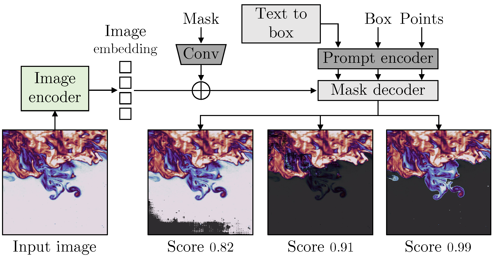
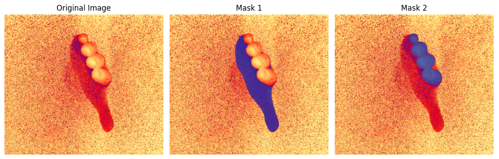

# Flow_segmentation

This is the official repository for "Segment Anything in Flow Experiments".

## News

- 2024.04.15: First release 

## Installation

1. Create a virtual environment: `conda create -n flowsam python=3.10 -y` and activate it: `conda activate flowsam`.
2. Clone the repository: `git clone https://github.com/AliRKhojasteh/Flow_segmentation`.
3. Enter the Flow_segmentation folder: `cd Notebook`.

## Get Started

Follow the instructions inside the Notebook folder. Open the `Flow_segmentation.ipynb`. Within the notebook, you will automatically install and clone required packages, input your image and the text prompt. The model checkpoints are downloaded and available.

1. Click on "Open in Colab" if you would like to **run on your browser** without the need for further installations.  

2. Read dependencies and install them
3. Loading the Input Image "Fingers.png"
4. text_prompt = 'Fingers and a hand'
5. Compute masks

## Sample Usage Permissions 
All examples available in the 'demo' directory are permitted for demonstration purposes only. For additional usage permissions, please contact the corresponding authors listed in the references. 

## References
This project makes use of the following repositories:

- [Segment Anything](https://github.com/facebookresearch/segment-anything)
- [GroundingDINO](https://github.com/IDEA-Research/GroundingDINO)
- [Lang Segment Anything](https://github.com/luca-medeiros/lang-segment-anything)
- [Lightning SAM](https://github.com/luca-medeiros/lightning-sam)
- [Supervision](https://github.com/roboflow/supervision)

